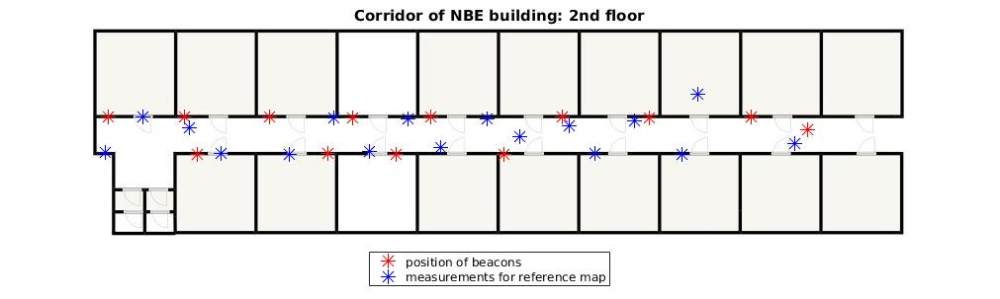

# Indoor Positioning

### A simple fingerprinting-based localization project:

- Setting up the beacons in a corridor of size 30m x 2.35m. 
- Creating the reference map by getting the RSS at predefined locations. Here, we took 20 measurements.
- Developed an interpolating observation model. (k-NN and simple GP regression: https://www.robots.ox.ac.uk/~mebden/reports/GPtutorial.pdf)
- Pair the observation model with a dynamic motion model (e.g. quasi-constant model)
- Build a PF with the above models
- Evaluate the results by using the model on the test data.

### Other details:
- Beacons used were from kontact.io.
- Product link: https://store.kontakt.io/our-products/27-beacon.html
- Measurements app: Indoor Atlas proprietary app *SenseServe*.
- Mobile platform: Android 6.0.1
- Mobile device: Nexus 6P
- Not considering the wifi data as the time-stamp recorded is wrong. 

### Beacon positions with measurements on the floor plan 

