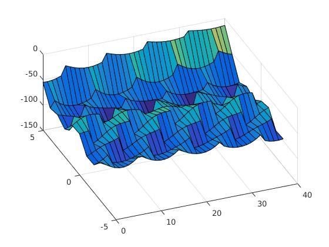

## Gaussian Process
- Need to give length scale to all the directions.
- Giving length scale [1.5 1.5], what if we have a wall in between. So signal strength will change drastically.
- what grid do we need? 0.1 grid takes a lot of time. 33000 points?
- We saw that at the boundaries, there was increase in the RSSI prediction. For example in the below figure, at y=5, which is actually a wall, the RSSI value bumps. 

- GP optimization of parameters the, noise variance in the likelihood is going negative. H