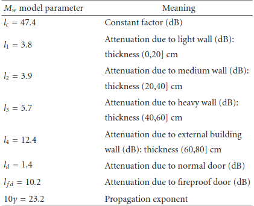

## Methods for Indoor positioning:
- Least squares
- Lateration: method for estimating the position of the device given the distance measurements. Non accurate as distance measure are usually noisy.
- Hyperbolic lateration: instead of distance, difference of distances is available.
- Angulation: angle between router1-device and device-router2. 
- Proximity detection
- Fingerprinting: missing data can be estimated using methods like EM(rather than simple mean estimation: source Quora). k-NN can be used. It performs the weighted sum of the k-neighbours' RSS values in the reference map. Weighted sum because some positions might be more reliable based surroundings and how accurate the measurements are(signal attenuation from furniture, signal scattering and signal reflection) 

# Observations from Literature review:
### Locating User Equipments and Access Points using RSSI Fingerprints: A Gaussian Process Approach. Yiu et al.

- **Drawback of fingerprinting** is that radiomap has to be computed when the circumstances change. This includes change in location of beacons (BLE or WiFi), restructuring of the of the indoor space. 

- If certain MAC is not heard during some measurement it is put to minimum power device sensitivity level, here our BLE beacon has `-93 dB` as sensitivity level and wifi are assumed to have `-110 dB`. Even the test data is replaced with the same constants.

### Wi-Fi Fingerprint-Based Indoor Positioning: Recent Advances and Comparisons. He et al.

- RSS can induce measurement noise, for example, multi-path effects.

- **Usage of temporal and spatial signal patterns**: in order to mitigate the error due to signal fluctuation, one method is to use the correlation between Wi-Fi signals and observable data like walking trajectory, indoor building structure and AP locations

- **Collaborative Localization** - using other bluetooth or sound to get the relative location with the neighbours.

- **Motion assisted localization** - using the sensors present the device.

- Deterministic and Probablistic methods are employed for localization.
      - Deterministic Algorithms (DA) use similarity metric like Euclidean distance, cosine similarity or Tanimato similarity for signal comparison.
      - DA are used as they are easy to implement. e.g., k-NN
      - SVM and LDA give better localization accuracy with higher computational cost.
      - Probabilistic algorithms (PA) use statistical inference, e.g., maximum likelihood, KL divergence, EM, GP.
      - One advantage is that we get uncertainty of estimates using these methods.
      
### Revisiting Gaussian Process Regression Modeling for Localization in Wireless Sensor Networks.

- Fingerprinting values must be taken in the same location with out a human, risk of signal attenuation. If human is recording the measurements, then measurements must be taken in four different directions and average them.
- Non parametric method but with parametric mean and covariance function. If there is enough evidence avialable(measurements), the model will override the avialable 

### Performance evaluation of Indoor Localization Techniques Based on RF Power measurements from Active or Passive Devices. De Luca et al.
- Line of Sight
- Avoid collision of signals. 
- Multiwall path loss model. refer **Channelmodels for IEEE 802.11b indoor system design**, Borrelli et al.
- Parameters for the model.

- So, passive systems can be designed to avoid collision among the signals . (Check **K. Finkenzeller, RFID Handbook: Fundamentals and Applications in Contactless Smart Cards and Identification** for more details)
- Active systems: BLE beacons vs Passive systems: RFID.
- **With increase in BLE beacons the probability of localization error reduces due to power measurement noise and quantization effects, it cannot be reduced below a limiting value.**

###### Characterization of the measurement noise:
	- "understanding of the power measurement errors due to the hardware in the terminal is important especially when the propagation map is made from experimantal data."
	- So difference in the quality of sensors/measuring devices have to be accounted for.
	- 5dB of variation across different measuring devices. 
	- At a fixed position the measurement of RSS varies and has sd of 2.5dBm.

- There is always a trade-off between number of AP's vs overlap of signals. For better accuracy, we need more AP's but at the cost of interfering signals.

## Suggestions for the project:
- BLE beacons RSS values in addition to proximity motion detector data, Active ahead predictive data (Active+ data, if lights are dim then it is less likely that someone is around) can improve the accuracy of the position.
- So need to create a solution which doesn't need creating of radio map even with slight change in the position of things inside a room, if incase fingerprinting is used.
- Use Chained Gaussian Processes for non-gaussian data. (or warped GP's; **need to study**)
- Signal collision avoidance system reaching the device. Will ensure correct measurement recording.
- Take fingerprinting measurements in all 4 canonical directionals to compensate for the signal attenuation.
- Can RFID can be deployed with BLE. Can make a hybrid of active and passive systems. [De Luca et al] Pros, cons: need to discuss.
 		
 		- Passive system need centralized server connected to smartphone, so extra cost. Not advisable. so, internet becomes a dependency
- **MUST USE:** multiwall channel model as we have more thin walls between the beacons. It accounts for the propagation at 2.4 GHz. [De Luca et al]
- So our model should be able to handle to variations across devices. So add a parameter to handle this. Gaussian Prior with standard deviation around 3 (or Student-t distribution with ....) [De Luca et al]
- Handle the measurement variation(power fluctuation), it can have a sd of 2.5dBm. [De Luca et al]
- Include orientation of device. Kaemarungsi et al.

## Doubts:
- Does placement of BLE beacon on the ceiling mitigate the multipath effect?
- So, with BLE beacon on the top (ceiling), should have no problems with line of sight?
- Suggest strategy to get collision resolution? [De Luca et al]
- Complex ray-tracing techniques when compared to multiwall model. 

# Aki Meeting

### Analysis of WLAN's received signal strength indication for indoor positioning location fingerprinting
###### Characteristics of RSSI:
- User orientation can have 5dBm of variation in RSSI measurement. so different orientation of mobile device w.r.t to access points can change mean value of RSSI. So, orientation shoul dbe also included.
- RSSI values drastically changes in presence of other users or change in furniture of the room.
- Movement of user causes fluctuation called small scale fading.
- Movement of device also causes large fluctations
- **Gaussian or log-normal** used to measure the variation in RSSI measurement.
- movement of people and mobile nodes causes fluctuation namely **time-correlated fluctuation**, can drasctically reduce the efficiency of positioning system.
- Interference of signal of same frequency.
- Measurement quality across devices varies.
- Not all access point are reliable.
- RSSI values recorded are quantized.
- At a single location RSSI values have an s.d of 2.5 dBm
- Chained GP or warped GP.
- Problem of bimodality (two locations may have same mesaurements)
- an change mean value of RSSI. So, orientation should be also included.
- RSSI values drastically changes in presence of other users or change in furniture of the room.
- Movement of user causes fluctuation called small scale fading.
- Movement of device also causes large fluctations
- **Gaussian or log-normal** used to measure the variation in RSSI measurement.
- movement of people and mobile nodes causes fluctuation namely **time-correlated fluctuation**, can drasctically reduce the efficiency of positioning system.
- Interference of signal of same frequency.
- Measurement quality across devices varies.
- Not all access point are reliable.
- RSSI values recorded are quantized.
- At a single location RSSI values have an s.d of 2.5 dBm
- Chained GP or warped GP.
- Two effects: Small scale fading and large scale fading.
		- Large scale fading: Path loss model. due to distance
		- Small scele fading: multipath, no line of sight( modeled as Rayleigh distribution.), line of sight(modeled as Rician distribution)
- High dBm values (greater than -80 dBm), the distribution is **left skewed**. **symmetric** when around -80 dBm, hence modeled as log normal.
- Different make of devices give different distribution of RSSI values. 
- So the distribution varies with duration of measurements recorded. Left skewed, right skewed. 
- 

